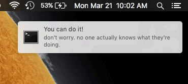

# Node Motivator

Inspirational statements via OS notification from the [NodeTogether Motivations](https://github.com/NodeTogether/motivations) repository.

Remind yourself that you can do it :)

## Prerequisites

This project requires [node.js and npm](https://nodejs.org/en/) (comes with node).

## Get up and running from npm

- Make your project folder:

        mkdir mycoolproject && cd mycoolproject

- Initilize your `package.json` file:

       npm init
       # Fill in fields or leave all blank to get default configuration

- Install and save motivator:

        npm install --save node-motivator

- Open a text editor and create an entry point (e.g.):

       touch index.js && atom .

- Require `node-motivator` and configure it (e.g.):

        // In index.js
        var Motivator = require('node-motivator')
        var motivator = new Motivator(5, 'mins')
        motivator.duration.measure = 20
        motivator.duration.unit = 'mins'

        motivator.motivateMe()

- Run it from the command line and feel motivated!:

        node index.js

- Open youtube and look up "Scarface (Push it to the Limit)" (e.g.):

        open https://www.youtube.com/watch?v=DZz3y6r-5H8

## Get up and running with example pulled from Github

- Clone this repo and cd into it:

        cd ~/Desktop
        git clone https://github.com/chris-schmitz/node-motivator motivator
        cd motivator

- Install the dependencies with npm:

        npm install

- Run the `test.js` file with node:

        node test.js
